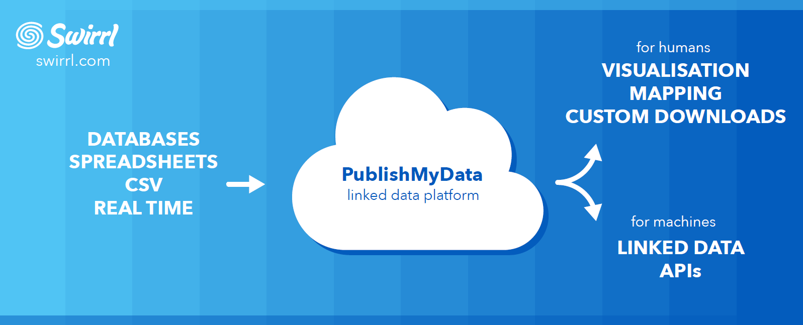

#Environmental Integrated Data Infrastructure (e-IDI) 

#Summary Report

## Executive Summary

### Objective

The environmental Integrated Data Infrastructure (e-IDI) aims to make environmental data more discoverable, shareable and accessible to support the supply and usage of data provided by local and central government agencies using a service on the Web.  The Proof of Concept (PoC) sought to test a basic architecture proposal for the system that would support this goal.

### Approach

The architecture was designed to leverage existing solutions and infrastructure, and meet key additional criteria identified by the NRS working group.  The PoC participants were then identified for each component of the architecture. Finally, the system was tested using real-time data and applications.

### Results
The PoC showed that a working system can be developed.  The system functioned correctly with appropriate response times.

### Findings & Recommendations

The PoC led to invaluable lessons that should be taken into account during the next phase of this project.
Key recommendations are as follows:

- Apply the linked data approach to augment existing approaches to publishing data.
- Build, maintain and leverage communities to deploy the linked data approach.
- Build and maintain vocabularies where communities agree to common terms applicable across similar datasets within and across domains.
- Publish data in open data standards  that also are compliant with OGC, ISO and other applicable international and national standards.
- Implement more robust metadata frameworks that comply with metadata standards for consistently describing open data.
- Build and maintain national registries for authoritative common terms, dataset and vocabulary access, and descriptions.
- Agree and develop a national approach for consistently naming all published resources on the Web. 

### Acknowledgements

The Natural Resource and Regional Sectors would like to thank all those who participated in the proof of concept project. In particular, the current team of Bill Roberts (Swirrl, UK), Adrienne Bonnington (HRC), Alison Stringer (MFE), Dan Elder (MFE), Sean Hodges (HRC), Paul Kennett (WRC), Jeff Cooke (HBRC), Iain Campion (ECan), Alistair Ritchie (Landcare Research). 
Previous project team members were Linn Murphy, Mike Horton, Simon Mitchell, Susan Cox (MFE), Paul Roberts (MFE).

### Conclusions
We consider that the PoC is a success and the lessons learned from it are an opportunity to build the foundations for a national data infrastructure. This project has generated interest from a number of parties both national and international, so there will be projects continuing on from this work.

The learnings and recommendations from the PoC should be actively integrated with any future projects, especially those that utilise a linked data approach.

As the PoC’s main aim was learning, we have made all products from the project publicly available. 

##Introduction

There is an increasing demand for central and local agencies to share data at the national level for public and government purposes.  Land, Air, Water Aotearoa  (LAWA) was a great example of an application where for the first time people could learn about the state of New Zealand’s rivers and beaches in one place.  LAWA has proved to be an effective tool for viewing environmental data collected by regional councils, however today this is not sufficient for working with data for three main reasons:

- The data is not combined in any way that can be queried, analysed or accessed within or across council datasets.
- The data was published specifically for the purpose of the LAWA application, consequently cannot be easily reused for other purposes.
- The architecture cannot be extended for future projects or purposes, so has a limited shelf life.

However, due to the implementation of open standards to supply data for LAWA, we were able to use the underlying infrastructure for the PoC.

## Objective

The environmental Integrated Data Infrastructure (e-IDI) Proof of Concept (PoC) aims to make environmental data more discoverable, shareable and accessible to support the supply and usage of real-time data, provided by local and central government agencies, using the Web.  

The Proof of Concept (PoC) sought to test a basic architecture proposal for the system that would support this goal.

The approach used for the PoC was designed with the following considerations in mind:

- Leverage existing river monitoring data services (including real-time) and other related datasets (leveraging standardised data provided for LAWA)
- Include multi-agency open data in varying formats
- Combine and query using standardised terminology
- Allow simple data access through data registers and downloadable methods
- Allow reuse of data and metadata in other applications
- Visualise data using various methods (e.g., maps, tables, charts)
- Wide applicability for use in other areas (i.e., not limited to the environmental sector)

## Method

With this in mind, an approach was designed where:

- Data is linked from across local and central government agency sources into a single data service.
- Common, known terms were applied to the data to ensure common understanding across similar datasets. For example, the term flow is used, even though some agencies use the term discharge. 
- Access to data in human- and machine-readable forms.

## Linked Data Approach

The PoC architecture applied the linked data approach of connecting and publishing structured data from different data sources and underlying systems by using standard Web technologies. While the approach does not change underlying data structures, it does allow mapping to common terms, linking to other data resources and querying across data sources.

For the PoC, the international marked was scanned for linked data providers. A commercial vendor, Swirrl from the UK provides the back-end application functionality that was needed to achieve the PoC’s objectives.  Swirrl’s PublishMyData solution was able to harmonise and combine data, as well as providing visualisations and ability to access data.  The PublishMyData service was already able to unify multiple data sources and query one or more data sources as identified in the Scottish Government deployment, and by other UK local government agencies. The PublishMyData (Figure 1) solution includes a flexible data transformation mechanism, which allowed the PoC to adapt to differing data formats and structures made available by each data provider.  These formats were able to be transformed into a common format made available through a single access point.  

*Figure 1: Swirrl’s PublishMyData Platform*

##Data
In order to test the PoC solution and validate the architecture, real time data was accessed from the participating data providers, described in Table 1.

Participants|Data supplied
---|---
**Hawkes Bay, Horizons, Environment Canterbury and Waikato Regional councils**	|River monitoring sites, river measurements (real time stage and flow data) and water management zones.
**Statistics NZ**	|Regional Boundaries  Meshblock (census related) data 
**Ministry for Environment (MFE)**	|River Environment Classification (REC) dataset that describes properties of the river reaches (e.g., climate, land use, geology etc.).

*Table 1: PoC Data Participants*

The input data included a number of different data formats i.e., XML data using the WFS and WaterML2 schemas, ESRI shapefiles and CSV files.

## Architecture Components
The PoC solution was divided into the following architecture components:

- **Standard Vocabularies**: existing authoritative glossaries were applied to the data (including metadata) to provide a common meaning and understanding.
- **Persistent URIs**: Uniform Resource Identifiers (URIs) are global identifiers for resources on the web.  To avoid link breakages, best practices were applied to URIs to ensure easier access to resources by users and applications.  
- **Standards**: Common web standards, data standards, and metadata standards are inherent to the linked data approach.  Also standardized terms were sought through vocabularies and applied to the data to provide consistent meaning across the datasets.
- **Metadata**: Information about the data was also published which described provenance of the data and guarantee the reliability of the data resources. 
- **Registries**:  to assist discoverability and accessibility to the datasets, metadata and common terms.  These items were applied across multiple applications to consistently describe the data.
- **Transformation**: the development pipeline process supplied by the PublishMyData platform as a service to harmonise datasets into standard formats for access, with the ultimate aim of acting as a brokering service.

## Learnings & Recommendations

We consider that the PoC is successful, and yielded a number of important lessons learnt that need to be considered for future projects. These learnings are based on the PoC architecture components from the methodology section.

### Linked Data Approach

The linked data approach is not a typical architecture applied in current data systems.  There is also a steep learning curve since the uptake of this technology has been slow, and is mostly limited to the confines of the developer community.  

The upside to this approach is that it is a very effective data brokering system that allows access to multiple data sources of varying formats, and returns interoperable data through a number of access points.  The PublishMyData platform was an an ‘as-a-service’ off-the-shelf solution, requiring some configuration, but since it is an open source project the code can be shared and reused.  This approach can be extended to other types of data, and consumed by many applications, including machine learning and artificial intelligence approaches

- ***Recommendation***: apply the linked data approach to augment existing approaches to publishing data.
- ***Recommendation***: build, maintain and leverage communities to deploy the linked data approach.

### Data

Standardisation of data is the key to successful data integration and was achieved in the PoC in two ways: 1) at the source where the data was standardized before the agency published it, and 2) on the fly, through the PublishMyData service transformation process.  The datasets provided by councils, were leveraged from the LAWA application, so generally standardised, but there were still variances identified (e.g., different units of measurements and terminology) which were harmonised through the transformation process.  The data was easily corrected through configuration and did not require changing at the source. The resultant output was linked data that was harmonized with a single access point for human and/or machine consumption. This access point also included linkages to metadata and data definitions (using registries and vocabularies).  The potential to link to other datasets beyond what was available in the PoC was then realized.

- ***Recommendation***: Build and maintain vocabularies where communities agree to common terms applicable across similar datasets within and across domains.
- ***Recommendation***: publish data to open data formats  that also are compliant with OGC, ISO and other applicable national and international standards.

### Discoverability

The PoC successfully catered for the user and other applications that provided the ability to search, query, view and access data resources in a consistent manner. 
 
When a data resource has been published on the Web, the publishing agency has a social contract with users to guarantee the reliability of this authoritative resource.  For the PoC, appropriate metadata elements were chosen that complied with global standards and consistent single global identifiers (or Uniform Resource Identifiers (URIs) were minted to represent the web resource.  Users could also look up the meaning of a data term to ensure the correct interpretation of the data through the use vocabularies and registers of terms. The accessibility of all these data resources was available in human and machine readable formats. The discoverability results for the PoC, successfully catered for the user and external applications providing the ability to search, query, view and access data resources in a consistent manner.  

- ***Recommendation***: a single agency that governs national registries for authoritative common terms, dataset and vocabulary access and descriptions.
- ***Recommendation***: a national approach/guidelines for consistently naming all published resources on the Web. This will also require a national Persistent Identifier (PID) service to implement logic of incoming requests for data retrieval.
- ***Recommendation***: Implement more robust metadata frameworks that comply to metadata standards for consistently describing open data.

## Conclusions

We consider that the PoC is a success and the lessons learnt from it are an opportunity to build the future foundations for a national data infrastructure. This project has generated interest from a number of parties both nationally and internationally, so there will be several projects continuing on from this work.

The learnings and recommendations from the PoC will be actively integrated with any future projects, especially those that use a linked data approach

